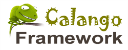

# Calango PHP Framework

This framework is designed to be simple and easy to implement. It is a framework that works with the MVC structure. Because it is simple, it gives developers greater freedom in their applications. It also has a structure that enables developers to simplify their work and increase productivity when building applications.

# How to cite

Ribeiro, S. S. (2025). PHP Calango framework and digital transformation: An introductory guide for beginners. _Iberoamerican Journal of Applied Computing_,  13(1). [Available at:] (https://revistas.uepg.br/index.php/ijac/article/view/24848)
